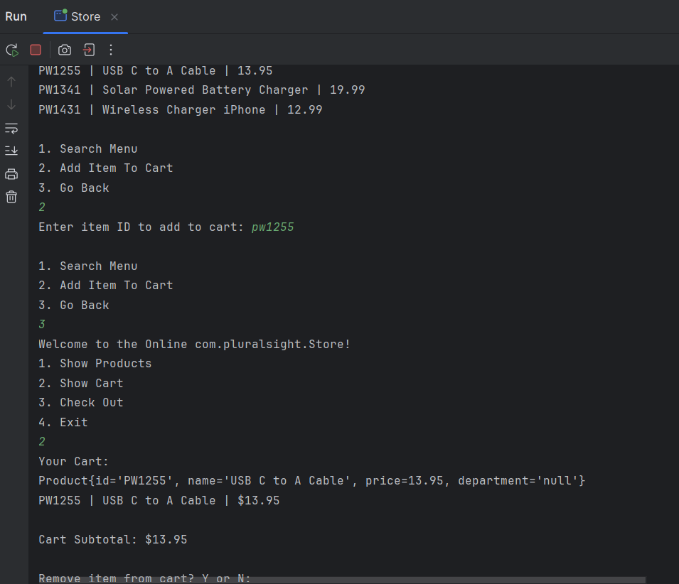

# Online Store

## Brief Synopsis

The **Online Store** application provides a mockup of an online storefront. It allows the user to look at the entire inventory, search for specific items, add/remove items from a cart, and check out with a receipt.

## Setup

### Prerequisites

- IntelliJ IDEA: Ensure you have IntelliJ IDEA installed, which you can download from [here](https://www.jetbrains.com/idea/download/).
- Java SDK: Make sure Java SDK is installed and configured in IntelliJ.

### Running the Application in IntelliJ

Follow these steps to get your application running within IntelliJ IDEA:

1. Open IntelliJ IDEA.
2. Select "Open" and navigate to the directory where you cloned or downloaded the project.
3. After the project opens, wait for IntelliJ to index the files and set up the project.
4. Find the main class with the `public static void main(String[] args)` method.
5. Right-click on the file and select 'Run 'Store.main()'' to start the application.

## Technologies Used

- Java: JDK 17
- import java.io.*; 
- import java.io.BufferedReader; 
- import java.io.FileReader; 
- import java.time.LocalDateTime; 
- import java.util.ArrayList; 
- import java.util.Scanner;

## Demo

## Resources

Stack Overflow is my saving grace.

## Thanks

- Thank you to [Raymond] for continuous support and guidance.
- Thanks [Carmen] and [Corrie] for keeping me from losing my mind.